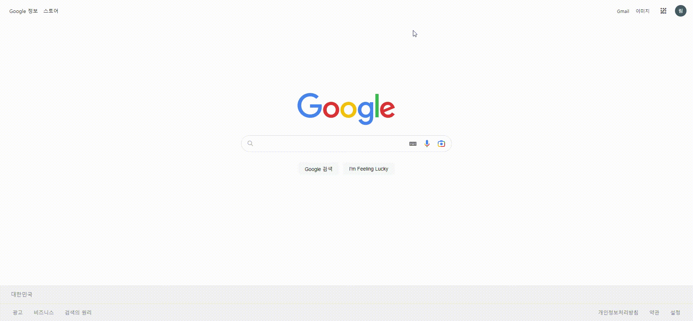
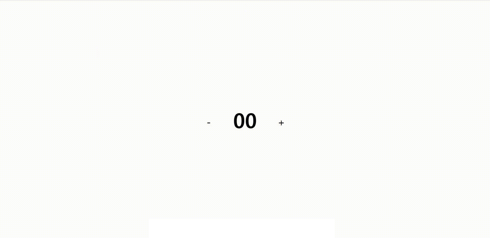

## Web Practice

ABC-LAB FE 과정 과제

ㅤ

ㅤ

## What I Did

- [가짜 구글 메인 페이지](https://github.com/baeseorim/WEB-PRACTICE/tree/master/230119) [2023-01-19]

  

- [배열](https://github.com/baeseorim/WEB-PRACTICE/tree/master/230126) [2023-01-26]

- [객체](https://github.com/baeseorim/WEB-PRACTICE/tree/master/230130) [2023-01-30]

- [숫자가 변하는 버튼](https://github.com/baeseorim/WEB-PRACTICE/tree/master/230202) [2023-02-02]

  

- [리액트 가짜 계산기]([숫자가 변하는 버튼](https://github.com/baeseorim/WEB-PRACTICE/tree/master/230209) ) [2023-02-09]